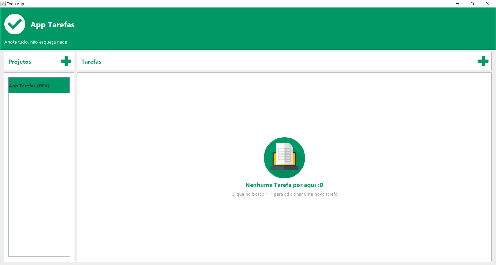
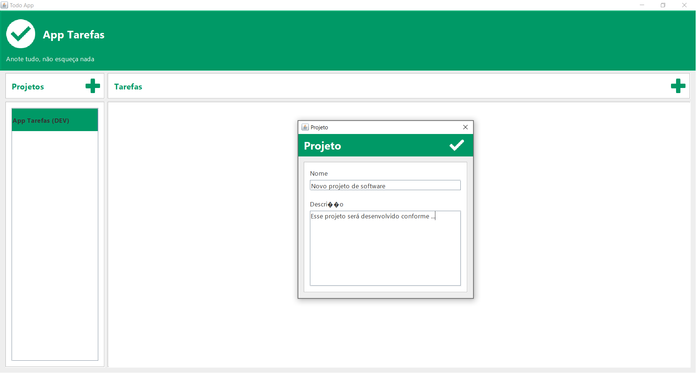
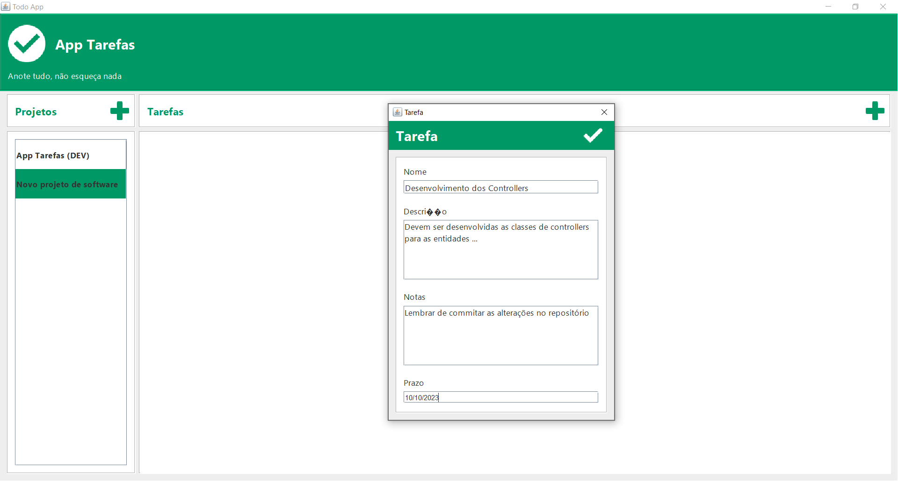
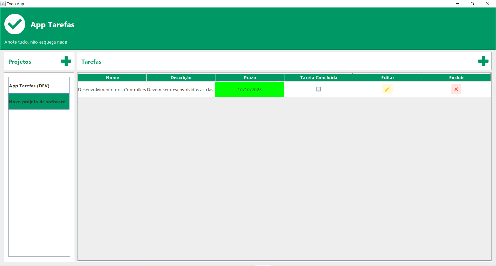

# LP-III
Repositório do curso de lógica de programação III

## Grade

1. Introdução ao treinamento e plano de ensino
2. Linguagem JAVA
* Conhecendo sua ferramenta de desenvolvimento (Netbeans)
* Diferenças entre Portugol e o JAVA
* Comentarios
* Comandos de entrada e saída
* Variaveis, tipos e operadores
* Estruturas condicionais
    * Estrutura if
    * Estrutura switch
    * Exercicios estruturas condicionais I
    * Exercicios estruturas condicionais II
* Estruturas de repetição
    * Estrutura while
    * Estrutura for
    * Exercicios estruturas de repetição I
    * Exercicios estruturas de repetição II
    * Exercicios estruturas de repetição II
* Orientação a Objetos
*  Classes
* Métodos
* Objetos
* Modificadores de acesso
* Métodos construtores
* Herança (Parte I)
* Exercícios JAVA
* Exercícios OO
3. Interfaces gráficas utilizando o SWING
*  Criando uma tela
* Paleta de Componentes
    * Componentes
    * Propriedades
    * Eventos (Programação orientada a eventos)
* Arvore de componentes
* Detalhes importantes
* Exercícios (crição de uma tela de login)
4. Iniciando um projeto
* Definição de um projeto básico
    * Requisitos do projeto
    * Regras de negócio
    * Definição da tecnologia
5. Especificando o Projeto
* Criando o as tabelas da aplicação
* Protótipo de interface
6. Iniciando a codificação
* Finalizando a criação das classes do modelo
* Criação da conexão com o Banco de Dados
* Criação dos controladores
* Construção da interface gráfica 
* Implementando a tela de cadastro de Projeto
* Implementando a tela de cadastro de Tarefa
* Carregando a lista de Projetos
* Implementando o model da lista de tarefas
* Finalizando as funcionaldiades básicas
* Customizações na interface
* Validações I
* Alternativas de implementação I
* Rodando a aplicação em modo debug
* Resultado obtido e considerações finais

***

## Projeto
O projeto que será desenvolvido durante o curso será uma aplicação para o gerenciamento de projetos e as tarefas envolvidas nesses projetos.

### Objetivo
Resolver a questão de organização de tarefas de um ou vários projetos.

### Requisitos
* A aplicação deve permitir criar uma projeto (CRUD)
* A aplicação deve permitir editar uma projeto (CRUD)
* A aplicação deve permitir excluir uma projeto (CRUD)
* A aplicação deve permitir buscar uma projeto (CRUD)

* A aplicação deve permitir criar uma tarefa (CRUD)
* A aplicação deve permitir editar uma tarefa (CRUD)
* A aplicação deve permitir excluir uma tarefa (CRUD)
* A aplicação deve permitir buscar uma tarefa (CRUD)

* A aplicação deve permitir criar uma tag (CRUD)
* A aplicação deve permitir editar uma tag (CRUD)
* A aplicação deve permitir excluir uma tag (CRUD)
* A aplicação deve permitir buscar uma tag (CRUD)

### Regras de negócio
- O sistema não contará com um sistema de login
- Não haverá o conceito de usuário
- Toda tarefa deve pertencer a uma lista
- Não podem haver tags repetidas numa mesma tarefa	
- Deve ser possivel filtrar as tarefas por tag

### Entidades

Projeto
- Nome
- Tarefas
- Data de Criação
- Data de Atualização

Tarefa
- Nome
- Descrição
- Status
- Tags
- Observações
- Prazo
- Data de Criação
- Data de Atualização

Tag
- Nome
- Cor
- Data de Criação
- Data de Atualização

***

## Telas

### Tela principal
<h1 align="center">
    
</h1>

### Tela de cadastro de projetos
<h1 align="center">
    
</h1>

### Tela de cadastro de tarefa
<h1 align="center">
    
</h1>

<h1 align="center">
    
</h1>

***